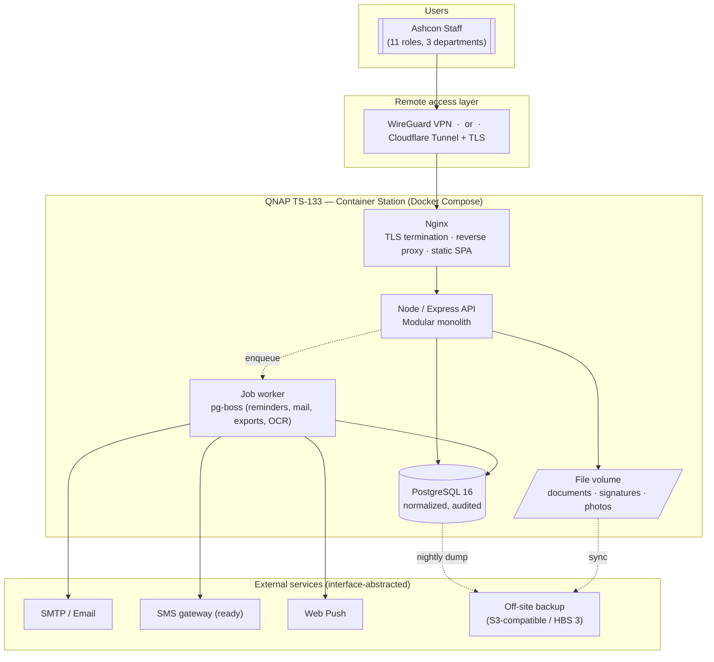
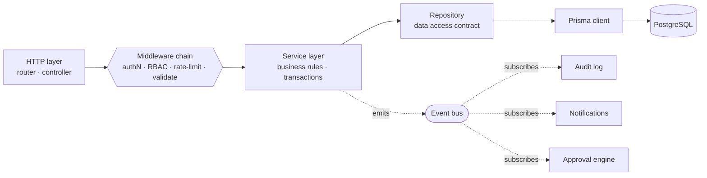

# Connect Affairs — System Architecture

**Enterprise Employee Management Portal for Ashcon Engineering**
Powered by Ashcon Engineering · Civil Engineering, Steel Structures, PEB, Construction & Infrastructure

| | |
|---|---|
| **Document** | 01 — System Architecture |
| **Status** | Draft for approval (Step 1 of 8) |
| **Scale target** | 20 → 50 employees, no architectural redesign |
| **Deployment** | QNAP TS-133 (Container Station) · remote-accessible |
| **Last updated** | 2026-07-17 |

---

## 1. Purpose & Scope

Connect Affairs is a single-tenant enterprise ERP/HRMS portal for internal use at Ashcon Engineering.
It is **production software**, not a prototype: it must be secure, auditable, backed up, and maintainable by a
small team, while remaining modular enough to grow feature-by-feature without touching the core.

This document defines the *shape* of the system. It is deliberately technology-decisive but implementation-light —
folder structure (Doc 03), database (Doc 02), authentication (Doc 04), and each business module follow as separate,
individually-approved deliverables.

---

## 2. Architectural Principles

1. **Modular monolith, plugin-based.** One deployable unit, internally partitioned into independent modules.
   This is the correct size for 20–50 users on constrained hardware — microservices would add operational cost with no benefit.
2. **Clean architecture per module.** Dependencies point inward: `HTTP → Service → Repository → Prisma → DB`. Business logic never imports Express or Prisma types directly.
3. **Contract-first, shared types.** A single Zod schema per entity is the source of truth for validation **and** TypeScript types, shared by frontend and backend. Define once, enforce everywhere.
4. **Everything is an event.** Domain actions emit events; audit, notifications, and approvals subscribe. Modules never call each other's internals.
5. **Secure by default.** Auth, RBAC, validation, rate-limiting, and audit are cross-cutting middleware applied to *every* route — opt-out, not opt-in.
6. **Hardware-honest.** Every dependency is chosen to fit 2 GB of RAM. No Redis, no Elasticsearch, no per-module process.
7. **Reversible storage & config.** File storage, mail transport, and secrets sit behind interfaces so local↔cloud swaps are config changes, not rewrites.

---

## 3. Key Technology Decisions (and why)

| Decision | Choice | Rationale |
|---|---|---|
| App topology | **Modular monolith** | Right-sized for the scale + hardware; simplest to operate & back up. |
| Background jobs / queue | **pg-boss** (Postgres-backed) | Reminder engine, emails, exports, expiry alerts — **without** running Redis (~saves 150–300 MB RAM). |
| Full-text search | **PostgreSQL FTS** (`tsvector` + GIN) | "Search everywhere" without Elasticsearch/OpenSearch (too heavy for 2 GB). |
| Server state (frontend) | **Redux Toolkit + RTK Query** | RTK is specified; RTK Query gives caching, pagination, and invalidation for free. |
| Validation & types | **Zod** shared package | One schema → runtime validation + inferred TS types on both sides. |
| ORM | **Prisma** | Type-safe queries, migrations, and a Prisma middleware seam for audit + soft-delete. |
| Repo layout | **pnpm monorepo (workspaces)** | Share `types`, `ui`, `config` across `api` and `web`; content-addressed store keeps the ARM disk lean. |
| Auth | **JWT access + rotating refresh**, TOTP 2FA | Stateless API, revocable sessions via a server-side session table. |
| PDF / Excel | **pdf-lib / SheetJS (xlsx)** | Pure-JS, no native binaries — matters for ARM64 Docker images. |
| OCR | **Tesseract, opt-in batch job** | CPU-heavy; runs off-peak via pg-boss, never inline on the request path (hardware constraint). |

---

## 4. System Context



---

## 5. Backend Architecture (Clean Layers)

Each business module is a self-contained vertical slice that stacks the same four layers. No layer skips another.



**Responsibilities**

- **HTTP layer** — routing, request/response mapping, HTTP status. No business logic.
- **Middleware chain** — JWT verification → permission check (`module:action`) → rate limit → Zod body/query validation → CSRF. Applied uniformly via a route factory so no endpoint can be created without it.
- **Service layer** — the module's business rules; owns database transactions; emits domain events. Pure TypeScript, unit-testable, no framework imports.
- **Repository** — the only code that touches Prisma. Enables mocking in tests and a future storage swap.
- **Event bus** — in-process emitter; audit/notification/approval handlers subscribe. Keeps modules decoupled.

---

## 6. The Plugin / Module System

The core app knows *nothing* about specific modules. Each module ships a **manifest** and self-registers at boot.
Adding a module = adding a folder + one manifest entry. Removing one = deleting the folder. The core never changes.

```ts
// Every module exports this contract (packages/module-kit)
export interface ModuleManifest {
  id: string;                       // "employee", "payroll", ...
  version: string;
  dependsOn?: string[];             // e.g. payroll dependsOn ["employee"]
  permissions: PermissionDef[];     // module:action pairs registered into RBAC
  routes: (router: Router) => void; // REST endpoints, auto-prefixed /api/<id>
  jobs?: JobDef[];                  // pg-boss scheduled/queued jobs
  events?: EventSubscription[];     // domain event handlers
  nav?: NavEntry[];                 // sidebar entries + required permission
  seed?: (ctx: SeedCtx) => Promise<void>;
}
```

- **Backend registry** discovers manifests, mounts routes under `/api/<id>`, registers permissions, wires jobs and event handlers, and runs seeds.
- **Frontend registry** mirrors this: each UI module registers its routes, lazy-loaded pages, and role-filtered sidebar entries. Navigation is **generated** from manifests filtered by the user's permissions — never hand-maintained.
- **Prisma schema** is composed from per-module `.prisma` files (Prisma multi-file schema), so each module owns its tables while sharing one database and one migration history.

This directly satisfies *"new modules can be added without modifying the core application."*

---

## 7. Frontend Architecture

```
React 18 + Vite + TypeScript
├─ App shell        Collapsible sidebar · top navbar (search/notifications/profile) · breadcrumbs · dark mode
├─ Module registry  Role-filtered routes & navigation generated from manifests
├─ Design system    ShadCN UI + Tailwind — the ONE component library (Doc 05)
├─ Server state     RTK Query (caching, pagination, optimistic updates, invalidation)
├─ Client state     Redux Toolkit slices (auth/session, UI prefs, theme)
├─ Forms            React Hook Form + Zod resolver (shared schemas)
└─ Primitives       DataTable, FormShell, ExportMenu, ForwardBox, ApprovalTimeline, FilterBar, PageHeader
```

**Design-language guarantee.** Every page is assembled from the same primitives, so "identical header/sidebar/cards/
tables/forms" is *structural*, not a matter of discipline. A page cannot be built off-pattern because the building
blocks enforce the pattern:

- `DataTable` → sticky/resizable/reorderable columns, column selection, row selection, bulk actions, search, advanced filters, CSV/Excel/PDF/Print, pagination, loading skeletons, empty states — **once**, reused everywhere.
- `FormShell` → validation, draft save, auto-save, attachments, comments, approval history, version history, cancel/reset — **once**.
- `ForwardBox` → the user-selection dropdown + reason + remarks forwarding control specified in the constitution — **once**.
- `PageScaffold` → breadcrumbs, permission gate, error boundary, activity timeline — wraps every page.

Theme: Professional Blue & White — primary `#11479B`, secondary `#F5F8FC`, rounded shadowed cards, soft-corner
buttons, dark-mode-ready via CSS variables. The company logo renders as a subtle centered dashboard watermark
(not in the header), per spec.

---

## 8. Cross-Cutting Platform Services

These live in the **core** and are consumed by every module — they are *the* mechanism behind the "every page / every
form / every table / every module must support…" rules.

| Service | Provides | Consumed as |
|---|---|---|
| **Identity & Access (RBAC)** | Users, 11 roles, permission matrix (`view/create/edit/delete/approve/export` per module) | Route middleware + `<Can>` UI guard |
| **Approval Workflow Engine** | Generic multi-step approvals, states, delegation | Any entity opts in via manifest |
| **Forwarding** | Route a record to a specific user for comment/review/approval with reason + remarks | `ForwardBox` + engine |
| **Audit Trail** | Immutable who/what/when/before/after on every mutation | Prisma middleware + event bus |
| **Notifications** | Email · SMS-ready · Web Push · in-app, with a reminder/expiry engine | `notify.dispatch(event)` |
| **File Storage** | Upload, versioning, watermarking, download logs, expiry alerts, signatures, OCR-ready | `StorageService` interface (local ↔ S3) |
| **Search** | Global + per-entity full-text (Postgres FTS) | Search bar + `/api/search` |
| **Reporting & Export** | Filterable reports, charts (Recharts), PDF (pdf-lib), Excel (xlsx), Print | `ExportMenu` + report registry |
| **Settings** | Company, departments, designations, branches, currencies, mail, backup, theme, language, timezone | Admin UI + config service |

---

## 9. Data Architecture

- **PostgreSQL 16**, third-normal-form design, foreign keys + `ON DELETE` rules, covering indexes, check constraints, and enums for controlled vocabularies.
- **Standard columns** on every table: `id` (cuid/uuid), `createdAt`, `updatedAt`, `createdBy`, `updatedBy`, `deletedAt` (soft delete).
- **Audit** table is append-only; audit writes happen in the same transaction as the mutation.
- **Money** as `Decimal` (never float); **timestamps** in UTC, rendered in the company timezone.
- **Per-module ownership**: each module's tables are defined in its own `.prisma` file; one shared migration history keeps referential integrity intact.
- Full ER diagram, Prisma schema, indexes, constraints, and seed data come in **Doc 02 — Database Design**.

---

## 10. Security Architecture (defense in depth)

| Layer | Control |
|---|---|
| Transport | TLS everywhere, HSTS, secure/`SameSite` cookies for refresh token |
| AuthN | JWT access (short-lived) + rotating refresh (server-side session table, revocable); TOTP 2FA; password policy; login history; active-session & device management; idle session timeout |
| AuthZ | RBAC permission matrix enforced in middleware **and** mirrored in the UI (`<Can>`); default-deny |
| Input | Zod validation on every body/query/param; type-safe Prisma params (no string-built SQL) → SQL-injection safe |
| Output | React auto-escaping + sanitisation on rich text → XSS safe; strict Content-Security-Policy |
| Request | CSRF protection (double-submit token), rate limiting (per-IP + per-user), payload size limits |
| Secrets | `.env` + Docker secrets; nothing in the repo; rotation-ready |
| Data | Bcrypt password hashing; encryption-at-rest for sensitive fields (salary, medical, bank); signed download URLs |
| Audit | Every privileged action logged immutably |
| Backup | Nightly encrypted `pg_dump` + file snapshot, off-site copy, tested restore |

---

## 11. Deployment Architecture — QNAP TS-133  ⚠️ read this

The TS-133 is an **entry-level, single-bay ARM NAS: ~2 GB RAM (non-expandable), quad-core ARM Cortex-A55, one drive (no RAID redundancy).** The application is designed to run on it, but you should make an informed hardware decision before we harden for production.

**Memory budget (realistic, under load):**

| Component | Tuned footprint |
|---|---|
| QTS OS + NAS services | ~0.7–1.0 GB |
| PostgreSQL (shared_buffers ≈128 MB) | ~0.25–0.4 GB |
| API **+ worker in one process** | ~0.25–0.4 GB |
| Nginx | ~0.03–0.05 GB |
| **Headroom remaining** | **thin** |

**What this means, honestly:**

- ✅ **20 users, normal HR/finance/project usage** → workable on the TS-133 with the tuning below.
- ⚠️ **Toward 50 users, or heavy concurrent PDF/Excel/OCR/report runs** → the box will get tight; response times suffer under spikes.
- 🔴 **Single drive = no redundancy.** A disk failure loses everything unless off-site backup is disciplined. This is non-negotiable to solve.

**Design choices that keep it viable (already baked into the architecture):** API + worker share one Node process; pg-boss instead of Redis; Postgres FTS instead of Elasticsearch; OCR and bulk exports run as off-peak queued jobs; ARM64 pure-JS libraries only; per-container memory limits in Compose.

**Because the *architecture* is identical on any host, the hardware choice does not block us** — only resource limits and where OCR/bulk jobs run differ. Options, best-effort ranked:

- **A — Ship on TS-133 (as specified).** Fine for the 20-user launch with tuning + strict off-site backup. Accept the headroom risk as you approach 50.
- **B — Recommended for comfort:** run the app + DB on an x86 QNAP (e.g. TS-264/TS-464 class, Intel, 8 GB+ RAM, dual-bay for RAID-1) and keep the TS-133 as the backup/file target. Real headroom to 50+, native x86 images, disk redundancy. *Same codebase, same Compose file.*
- **C — Hybrid:** app + DB on a small always-on mini-PC or a low-cost cloud VM; QNAP serves files + backups.

**Remote access (pick one):**

- **WireGuard VPN (QVPN)** — staff dial in, portal never exposed to the public internet. Most secure; needs a client per device.
- **Cloudflare Tunnel + TLS** — browser access from anywhere with **no inbound ports opened**, plus WAF/rate-limiting at the edge. Best balance of security + convenience.
- ~~Raw port-forwarding~~ — not recommended.

**Backup & restore (mandatory given single drive):** nightly encrypted `pg_dump` → external USB **and** off-site (S3-compatible or QNAP HBS 3); file-volume snapshots; documented + periodically **tested** restore runbook.

**Delivery:** Docker Compose (nginx · api · postgres), one `.env`, GitHub Actions building multi-arch (arm64/amd64) images, health checks per container.

---

## 12. Observability & Operations

- **Structured logging** (pino) with request IDs; log rotation sized for the NAS disk.
- **Health checks**: `/healthz` (liveness) + `/readyz` (DB reachable) wired into Compose.
- **Error surface**: consistent error envelope from the API; toast + boundary on the client.
- **Migrations**: Prisma migrate on deploy, gated behind a backup step.
- **Metrics-ready**: counters/timings exposed for later scrape if desired (kept off by default to save RAM).

---

## 13. Module Inventory

Your ~200 features consolidate into **1 platform core + 13 business modules**. Each module is an independent plugin.

**Platform Core (foundation — the shared spine):**
Identity & Access · Authentication · Settings · Audit · Notifications & Reminder Engine · Approval & Forwarding Engine · File/Attachment service · Global Search · Reporting & Export · App Shell & Dashboard.

**Business modules:**

| # | Module | Covers |
|---|---|---|
| 1 | **Employee** | Profiles, personal/emergency/education/experience/certifications/skills, documents, medical, salary info, attendance history, reviews, transfers, disciplinary, exit, digital signature, photo |
| 2 | **HR Operations** | Attendance, leave, holidays, recruitment, interviews, onboarding, performance, training, warnings, termination, resignation, letters (experience/salary cert), promotion, transfer, exit clearance |
| 3 | **Payroll** | Salary structure, allowances, deductions, overtime, tax, bonuses, loans, payslips, bank-transfer reports, approval workflow |
| 4 | **Finance** | Chart of accounts, cash book, banks, journals, payments, receipts, invoices, billing, expenses & claims, budget, project-cost tracking, P&L, balance sheet, cash flow, GST/VAT |
| 5 | **Procurement** | Purchase requests, vendors, POs, approvals, GRNs, purchase invoices, supplier payments, vendor performance, equipment register |
| 6 | **Inventory** | Categories, warehouses, stock levels/movement, material requests, issue/return notes, transfers, min-stock alerts, maintenance, fuel log |
| 7 | **Projects** | Creation, milestones, tasks, Gantt, resources, BOQ link, cost tracking, progress & daily site reports, material consumption, equipment allocation, site photos, RFI, submittals, variation orders, sub-contractor/supplier mgmt |
| 8 | **BOQ** | Estimate creation, rate analysis, import/export, variation comparison, revision history, approval workflow |
| 9 | **Vehicle / Fleet** | Vehicle register, driver assignment, fuel consumption, maintenance, tracking, documents |
| 10 | **Document Mgmt** | Folders, categories, version control, watermarking + approval for un-watermarked, download logs, approval workflow, preview, share, expiry alerts, signatures, OCR-ready |
| 11 | **Helpdesk** | Leave/HR/Ops/Finance/Procurement/Reimbursement/Admin requests, complaints (incl. anonymous) |
| 12 | **Internal Comms** | Company chat, announcements, discussion boards, DMs, department channels, mentions, read receipts |
| 13 | **Calendar** | Meetings, leave, deadlines, milestones, company events |

Reports and Search are delivered as **core services** plus a per-module report pack, so every module inherits them.

---

## 14. Build Roadmap (approval-gated)

You approve each phase before the next begins; completed code is never regenerated unless you request a change.
**Phase 0 corresponds to your deliverables 2–5** (database, folders, auth, UI kit) and the app shell — the foundation every module stands on.

| Phase | Deliverable | Your gate |
|---|---|---|
| **0.1** | **This document** — System Architecture | ← you are here |
| 0.2 | Database Design (ER + Prisma + seed) — Doc 02 | approve |
| 0.3 | Folder / Repo Structure — Doc 03 | approve |
| 0.4 | Authentication design + implementation — Doc 04 | approve |
| 0.5 | Reusable UI component library — Doc 05 | approve |
| 0.6 | App shell + role-based Dashboard | approve |
| 1 | **Employee** module | approve |
| 2 | **HR Operations** module | approve |
| 3 | **Payroll** module | approve |
| 4 | **Finance** module | approve |
| 5 | **Procurement** module | approve |
| 6 | **Inventory** module | approve |
| 7 | **Projects** module | approve |
| 8 | **BOQ** module | approve |
| 9 | **Vehicle / Fleet** module | approve |
| 10 | **Document Management** module | approve |
| 11 | **Helpdesk** module | approve |
| 12 | **Internal Comms + Calendar** | approve |
| 13 | Reporting/Search polish · security hardening · deployment | approve |

Each business module ships complete: DB tables · API · validation · services · UI · reports · permissions · notifications · audit · unit tests · docs — nothing is a placeholder.

---

## 15. Non-Functional Targets

- **Performance:** typical list/detail responses < 300 ms on the target hardware for 20 concurrent users.
- **Scalability:** 20 → 50 users with only config/resource changes; no re-architecture.
- **Availability:** single-node; RTO/RPO governed by the nightly backup + tested restore.
- **Maintainability:** a new module adds a folder + manifest; core untouched.
- **Accessibility:** keyboard-navigable, semantic HTML, WCAG-AA color contrast in both themes.
- **Auditability:** every privileged mutation is attributable and immutable.

---

## 16. Resolved Decisions

Confirmed 2026-07-17 (owner delegated to engineering).

1. **Deployment hardware** — Design to the **TS-133 as the constraint floor**; **recommend** provisioning an x86 QNAP (≥8 GB RAM, dual-bay RAID-1) for production headroom. The codebase and Compose stack are identical on either host, so hardware can be upgraded without any code change.
2. **Remote access** — **Cloudflare Tunnel** for staff browser access (no inbound ports, edge WAF/rate-limiting) **plus WireGuard VPN (QVPN)** for administrators.
3. **Email transport** — **nodemailer over SMTP**, configurable in Settings (compatible with Microsoft 365 / Google Workspace / any SMTP host). No provider lock-in.
4. **SMS** — **interface-ready, disabled by default**; enable once a gateway is chosen.
5. **Digital signatures** — **drawn/typed in-app**. Certificate-based (PKI) signing is deferred as a future module.
6. **Locale defaults** — fully **configurable** via a first-run setup wizard. Seeded defaults: base currency **PKR**, timezone **Asia/Karachi**, tax regime **GST**, language **English**. Changeable in Company Settings without code changes.

---

*Next: Doc 02 — Database Design (ER diagram, Prisma schema, indexes, constraints, seed data), on your approval.*
