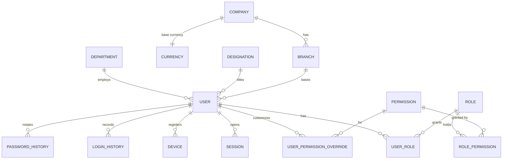
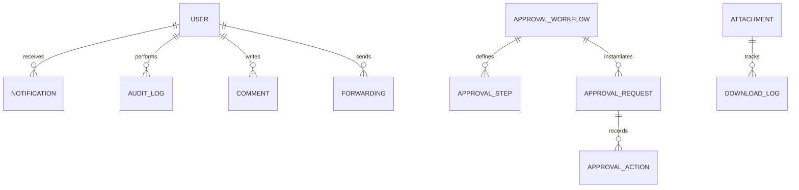
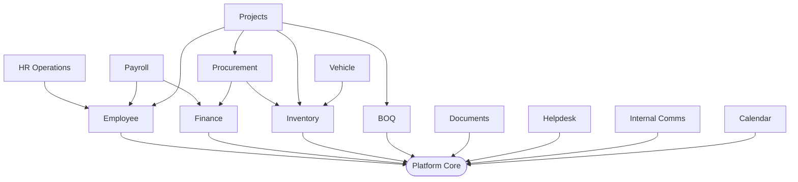

# Connect Affairs — Database Design (Core / Platform)

| | |
|---|---|
| **Document** | 02 — Database Design |
| **Status** | Draft for approval (Step 2 of 8) |
| **Engine** | PostgreSQL 16 · Prisma 5 (multi-file schema) |
| **Scope** | Platform core (the shared spine). Each business module contributes its own tables in its phase. |

---

## 1. Why the core first (and not all 100+ tables now)

Your build is module-by-module, and each module owns its own tables. Designing all thirteen modules' schemas up
front would be unreviewable and would contradict that principle. So Doc 02 delivers the **platform core** — the tables
every module depends on (identity, RBAC, sessions, audit, notifications, files, approvals, org structure, settings).
This is also exactly what **Step 4 (Authentication)** needs. Each module's tables arrive with the module, referencing
these core models. Section 9 shows how they plug in.

---

## 2. Conventions (apply to every table, core and module)

| Convention | Rule |
|---|---|
| **Primary keys** | `cuid()` strings (`id`). Collision-safe, non-guessable, no sequence contention. |
| **Timestamps** | `createdAt @default(now())`, `updatedAt @updatedAt`. Stored **UTC**, rendered in company timezone. |
| **Actor columns** | `createdById` / `updatedById` (string user ids, app-enforced — kept relation-free to avoid dozens of back-relations on `User`). |
| **Soft delete** | `deletedAt DateTime?` on business entities; queries filter it out via a Prisma extension. Audit + auth tables are **not** soft-deleted. |
| **Money** | `Decimal @db.Decimal(18,2)` — never `Float`. Rates: `Decimal @db.Decimal(9,4)`. |
| **Controlled vocab** | Postgres `enum` for fixed sets; lookup tables where values are user-manageable. |
| **Polymorphic links** | `entityType` + `entityId` pair (Attachment, Comment, AuditLog, Approval, Forwarding), each with a composite index. Prisma has no native polymorphic FK; this is the standard, index-backed pattern. |
| **Naming** | `snake_case` tables via `@@map`, `camelCase` in Prisma models; join tables named by relation. |
| **Indexing** | Every FK, every column used in a filter/sort, and every polymorphic pair is indexed. |
| **Sensitive fields** | Salary, medical, bank, 2FA secrets are application-encrypted at rest (AES-GCM) before storage. |

---

## 3. Core ER — Identity, Access & Org



## 4. Core ER — Cross-cutting services



---

## 5. Complete Core Prisma Schema

> This is the real schema for the platform core. It compiles as-is against PostgreSQL 16.
> Module schemas (Employee, Payroll, …) are added as sibling files under `prisma/schema/` and reference these models.

```prisma
// prisma/schema/00-core.prisma
generator client {
  provider        = "prisma-client-js"
  previewFeatures = ["prismaSchemaFolder"] // multi-file schema (one file per module)
}

datasource db {
  provider = "postgresql"
  url      = env("DATABASE_URL")
}

// ────────────────────────────── ENUMS ──────────────────────────────
enum UserStatus {
  INVITED
  ACTIVE
  LOCKED
  SUSPENDED
  DISABLED
}

enum PermissionAction {
  VIEW
  CREATE
  EDIT
  DELETE
  APPROVE
  EXPORT
}

enum OverrideEffect {
  ALLOW
  DENY
}

enum ApprovalState {
  DRAFT
  PENDING
  APPROVED
  REJECTED
  RETURNED
  CANCELLED
}

enum ApprovalDecision {
  APPROVED
  REJECTED
  RETURNED
}

enum ForwardPurpose {
  COMMENT
  REVIEW
  APPROVAL
}

enum ForwardStatus {
  OPEN
  RESPONDED
  CLOSED
}

enum NotificationChannel {
  IN_APP
  EMAIL
  SMS
  PUSH
}

enum TaxType {
  GST
  VAT
  SST
  NONE
}

enum AnnouncementAudience {
  ALL
  DEPARTMENT
  ROLE
}

// ─────────────────────── ORGANISATION / SETTINGS ───────────────────────
model Company {
  id                   String   @id @default(cuid())
  name                 String
  legalName            String?
  logoUrl              String?
  addressLine1         String?
  addressLine2         String?
  city                 String?
  state                String?
  country              String?
  postalCode           String?
  phone                String?
  email                String?
  website              String?
  baseCurrencyId       String
  baseCurrency         Currency @relation(fields: [baseCurrencyId], references: [id])
  timezone             String   @default("Asia/Karachi")
  locale               String   @default("en")
  dateFormat           String   @default("dd-MMM-yyyy")
  fiscalYearStartMonth Int      @default(7) // 1–12
  taxType              TaxType  @default(GST)
  defaultTaxRate       Decimal  @default(0) @db.Decimal(9, 4)
  setupCompleted       Boolean  @default(false) // gates the first-run wizard
  createdAt            DateTime @default(now())
  updatedAt            DateTime @updatedAt

  branches Branch[]

  @@map("company")
}

model Branch {
  id           String   @id @default(cuid())
  companyId    String
  company      Company  @relation(fields: [companyId], references: [id])
  name         String
  code         String   @unique
  addressLine1 String?
  city         String?
  country      String?
  phone        String?
  isHeadOffice Boolean  @default(false)
  active       Boolean  @default(true)
  createdAt    DateTime @default(now())
  updatedAt    DateTime @updatedAt
  users        User[]

  @@index([companyId])
  @@map("branch")
}

model Department {
  id          String       @id @default(cuid())
  name        String       @unique
  code        String       @unique
  description String?
  headUserId  String?
  active      Boolean      @default(true)
  createdAt   DateTime     @default(now())
  updatedAt   DateTime     @updatedAt
  users       User[]
  designations Designation[]

  @@map("department")
}

model Designation {
  id           String      @id @default(cuid())
  name         String
  code         String      @unique
  departmentId String?
  department   Department? @relation(fields: [departmentId], references: [id])
  level        Int         @default(0)
  active       Boolean     @default(true)
  createdAt    DateTime    @default(now())
  updatedAt    DateTime    @updatedAt
  users        User[]

  @@index([departmentId])
  @@map("designation")
}

model Currency {
  id        String    @id @default(cuid())
  code      String    @unique // ISO 4217, e.g. PKR
  name      String
  symbol    String
  isBase    Boolean   @default(false)
  active    Boolean   @default(true)
  companies Company[]

  @@map("currency")
}

model AppSetting {
  id       String   @id @default(cuid())
  key      String   @unique
  value    Json
  category String   @default("general")
  updatedAt DateTime @updatedAt

  @@index([category])
  @@map("app_setting")
}

// ─────────────────────────── IDENTITY / USER ───────────────────────────
model User {
  id             String     @id @default(cuid())
  employeeCode   String?    @unique
  email          String     @unique
  passwordHash   String
  firstName      String
  lastName       String
  phone          String?
  avatarUrl      String?
  status         UserStatus @default(INVITED)
  isSuperAdmin   Boolean    @default(false) // break-glass; bypasses matrix

  departmentId   String?
  department     Department?  @relation(fields: [departmentId], references: [id])
  designationId  String?
  designation    Designation? @relation(fields: [designationId], references: [id])
  branchId       String?
  branch         Branch?      @relation(fields: [branchId], references: [id])

  // password policy
  mustChangePassword Boolean   @default(true)
  passwordChangedAt  DateTime?

  // 2FA
  twoFactorEnabled   Boolean   @default(false)
  twoFactorSecret    String?   // AES-GCM encrypted
  twoFactorCodes     Json?     // encrypted recovery codes

  // lockout
  failedLoginCount   Int       @default(0)
  lockedUntil        DateTime?
  lastLoginAt        DateTime?

  createdById String?
  updatedById String?
  createdAt   DateTime  @default(now())
  updatedAt   DateTime  @updatedAt
  deletedAt   DateTime?

  roles           UserRole[]
  overrides       UserPermissionOverride[]
  sessions        Session[]
  devices         Device[]
  loginHistory    LoginHistory[]
  passwordHistory PasswordHistory[]
  notifications   Notification[]

  @@index([departmentId])
  @@index([designationId])
  @@index([branchId])
  @@index([status])
  @@map("app_user")
}

// ───────────────────────────── RBAC ─────────────────────────────
model Role {
  id          String   @id @default(cuid())
  key         String   @unique // super_admin, ceo, managing_director, ...
  name        String
  description String?
  isSystem    Boolean  @default(false) // system roles cannot be deleted
  rank        Int      @default(100)   // lower = higher authority
  active      Boolean  @default(true)
  createdAt   DateTime @default(now())
  updatedAt   DateTime @updatedAt

  users       UserRole[]
  permissions RolePermission[]

  @@map("role")
}

model Permission {
  id          String           @id @default(cuid())
  key         String           @unique // "employee:create"
  module      String                    // "employee"
  action      PermissionAction
  description String?

  roles     RolePermission[]
  overrides UserPermissionOverride[]

  @@index([module])
  @@map("permission")
}

model RolePermission {
  roleId       String
  permissionId String
  role         Role       @relation(fields: [roleId], references: [id], onDelete: Cascade)
  permission   Permission @relation(fields: [permissionId], references: [id], onDelete: Cascade)

  @@id([roleId, permissionId])
  @@index([permissionId])
  @@map("role_permission")
}

model UserRole {
  userId     String
  roleId     String
  assignedAt DateTime @default(now())
  assignedBy String?
  user       User     @relation(fields: [userId], references: [id], onDelete: Cascade)
  role       Role     @relation(fields: [roleId], references: [id], onDelete: Cascade)

  @@id([userId, roleId])
  @@index([roleId])
  @@map("user_role")
}

// Per-user "Customized Portal Access" — grant or revoke a single permission
model UserPermissionOverride {
  id           String         @id @default(cuid())
  userId       String
  permissionId String
  effect       OverrideEffect
  reason       String?
  createdAt    DateTime       @default(now())
  user         User           @relation(fields: [userId], references: [id], onDelete: Cascade)
  permission   Permission     @relation(fields: [permissionId], references: [id], onDelete: Cascade)

  @@unique([userId, permissionId])
  @@map("user_permission_override")
}

// ──────────────────────── SESSIONS / AUTH ────────────────────────
model Session {
  id               String    @id @default(cuid())
  userId           String
  refreshTokenHash String    @unique // SHA-256 of the refresh token
  deviceId         String?
  userAgent        String?
  ip               String?
  expiresAt        DateTime
  lastUsedAt       DateTime  @default(now())
  revokedAt        DateTime?
  createdAt        DateTime  @default(now())
  user             User      @relation(fields: [userId], references: [id], onDelete: Cascade)
  device           Device?   @relation(fields: [deviceId], references: [id])

  @@index([userId])
  @@index([expiresAt])
  @@map("session")
}

model Device {
  id          String    @id @default(cuid())
  userId      String
  name        String?
  fingerprint String
  trusted     Boolean   @default(false)
  lastSeenAt  DateTime  @default(now())
  createdAt   DateTime  @default(now())
  user        User      @relation(fields: [userId], references: [id], onDelete: Cascade)
  sessions    Session[]

  @@unique([userId, fingerprint])
  @@map("device")
}

model LoginHistory {
  id        String   @id @default(cuid())
  userId    String?
  email     String
  success   Boolean
  reason    String?  // BAD_PASSWORD, LOCKED, 2FA_FAIL, OK ...
  ip        String?
  userAgent String?
  createdAt DateTime @default(now())
  user      User?    @relation(fields: [userId], references: [id])

  @@index([userId])
  @@index([email])
  @@index([createdAt])
  @@map("login_history")
}

model PasswordResetToken {
  id        String    @id @default(cuid())
  userId    String
  tokenHash String    @unique
  expiresAt DateTime
  usedAt    DateTime?
  createdAt DateTime  @default(now())

  @@index([userId])
  @@map("password_reset_token")
}

model PasswordHistory {
  id           String   @id @default(cuid())
  userId       String
  passwordHash String
  createdAt    DateTime @default(now())
  user         User     @relation(fields: [userId], references: [id], onDelete: Cascade)

  @@index([userId])
  @@map("password_history")
}

// ───────────────────────── AUDIT / ACTIVITY ─────────────────────────
model AuditLog {
  id         String   @id @default(cuid())
  actorId    String?
  action     String   // CREATE, UPDATE, DELETE, LOGIN, APPROVE, EXPORT ...
  module     String?
  entityType String
  entityId   String?
  before     Json?
  after      Json?
  ip         String?
  userAgent  String?
  createdAt  DateTime @default(now())

  @@index([entityType, entityId])
  @@index([actorId])
  @@index([module])
  @@index([createdAt])
  @@map("audit_log")
}

// ───────────────────────── NOTIFICATIONS ─────────────────────────
model Notification {
  id         String              @id @default(cuid())
  userId     String
  title      String
  body       String?
  type       String              // approval, mention, expiry, reminder ...
  channel    NotificationChannel @default(IN_APP)
  entityType String?
  entityId   String?
  meta       Json?
  readAt     DateTime?
  createdAt  DateTime            @default(now())
  user       User                @relation(fields: [userId], references: [id], onDelete: Cascade)

  @@index([userId, readAt])
  @@index([createdAt])
  @@map("notification")
}

model NotificationPreference {
  id       String   @id @default(cuid())
  userId   String
  type     String
  channels String[] // enabled channels for this type
  enabled  Boolean  @default(true)

  @@unique([userId, type])
  @@map("notification_preference")
}

// ─────────────── APPROVAL ENGINE (generic, reusable) ───────────────
model ApprovalWorkflow {
  id         String            @id @default(cuid())
  key        String            @unique // "payroll.run", "boq.revision" ...
  name       String
  entityType String
  active     Boolean           @default(true)
  steps      ApprovalStep[]
  requests   ApprovalRequest[]
  createdAt  DateTime          @default(now())

  @@map("approval_workflow")
}

model ApprovalStep {
  id         String           @id @default(cuid())
  workflowId String
  order      Int
  name       String
  roleKey    String?          // approver by role, or...
  approverId String?          // ...specific user
  quorum     Int              @default(1)
  workflow   ApprovalWorkflow @relation(fields: [workflowId], references: [id], onDelete: Cascade)

  @@unique([workflowId, order])
  @@map("approval_step")
}

model ApprovalRequest {
  id          String           @id @default(cuid())
  workflowId  String?
  entityType  String
  entityId    String
  state       ApprovalState    @default(PENDING)
  currentStep Int              @default(1)
  initiatedBy String
  createdAt   DateTime         @default(now())
  completedAt DateTime?
  workflow    ApprovalWorkflow? @relation(fields: [workflowId], references: [id])
  actions     ApprovalAction[]

  @@index([entityType, entityId])
  @@index([state])
  @@map("approval_request")
}

model ApprovalAction {
  id        String           @id @default(cuid())
  requestId String
  stepOrder Int
  actorId   String
  decision  ApprovalDecision
  remarks   String?
  createdAt DateTime         @default(now())
  request   ApprovalRequest  @relation(fields: [requestId], references: [id], onDelete: Cascade)

  @@index([requestId])
  @@map("approval_action")
}

// ─────────── FORWARDING (comment / review / approval routing) ───────────
model Forwarding {
  id          String        @id @default(cuid())
  entityType  String
  entityId    String
  fromUserId  String
  toUserId    String
  purpose     ForwardPurpose
  reason      String
  remarks     String?
  status      ForwardStatus @default(OPEN)
  respondedAt DateTime?
  createdAt   DateTime      @default(now())

  @@index([entityType, entityId])
  @@index([toUserId, status])
  @@map("forwarding")
}

// ───────────────────────── COMMENTS (polymorphic) ─────────────────────────
model Comment {
  id         String    @id @default(cuid())
  entityType String
  entityId   String
  authorId   String
  body       String
  parentId   String?
  createdAt  DateTime  @default(now())
  editedAt   DateTime?
  deletedAt  DateTime?
  author     User      @relation(fields: [authorId], references: [id])
  parent     Comment?  @relation("CommentThread", fields: [parentId], references: [id])
  replies    Comment[] @relation("CommentThread")

  @@index([entityType, entityId])
  @@map("comment")
}

// ──────────────── FILES / ATTACHMENTS (+ download logs) ────────────────
model Attachment {
  id          String        @id @default(cuid())
  entityType  String
  entityId    String
  fileName    String
  storageKey  String        // local path or S3 key (behind StorageService)
  mimeType    String
  size        Int
  checksum    String?
  version     Int           @default(1)
  watermarked Boolean       @default(false)
  uploadedById String
  expiresAt   DateTime?
  createdAt   DateTime      @default(now())
  deletedAt   DateTime?
  downloads   DownloadLog[]

  @@index([entityType, entityId])
  @@index([expiresAt])
  @@map("attachment")
}

model DownloadLog {
  id           String     @id @default(cuid())
  attachmentId String
  userId       String
  ip           String?
  createdAt    DateTime   @default(now())
  attachment   Attachment @relation(fields: [attachmentId], references: [id], onDelete: Cascade)

  @@index([attachmentId])
  @@map("download_log")
}

// ─────────────────────────── ANNOUNCEMENTS ───────────────────────────
model Announcement {
  id           String               @id @default(cuid())
  title        String
  body         String
  audience     AnnouncementAudience @default(ALL)
  audienceRef  String?              // departmentId or roleId when scoped
  pinned       Boolean              @default(false)
  publishedAt  DateTime?
  expiresAt    DateTime?
  createdById  String
  createdAt    DateTime             @default(now())
  updatedAt    DateTime             @updatedAt

  @@index([publishedAt])
  @@map("announcement")
}

// ─────────── SAVED VIEWS (per-user table column/filter config) ───────────
model SavedView {
  id        String   @id @default(cuid())
  userId    String
  module    String
  name      String
  config    Json     // columns, order, widths, filters, sort
  isDefault Boolean  @default(false)
  createdAt DateTime @default(now())

  @@index([userId, module])
  @@map("saved_view")
}
```

---

## 6. Indexes, Constraints & Integrity — highlights

- **Uniqueness:** `User.email`, `User.employeeCode`, `Role.key`, `Permission.key`, `Branch.code`, `Currency.code`, `Session.refreshTokenHash`, `(User, fingerprint)`, `(User, permission)` override, `(workflow, order)`.
- **Cascades:** deleting a `User`/`Role` cascades its join rows, sessions, devices, tokens; audit + login history are **preserved** (nullable actor).
- **Composite indexes** back every polymorphic pair `(entityType, entityId)` and hot lookups like `Notification(userId, readAt)` and `Forwarding(toUserId, status)`.
- **Check-style guarantees** via enums (status, decisions, channels) — invalid states are unrepresentable.
- **Referential base currency:** `Company.baseCurrencyId → Currency` guarantees a valid base currency always exists.

---

## 7. Seed Data (deterministic, idempotent)

Seeds run via `prisma db seed` and are safe to re-run.

**Departments (3):** Technical · Administration & Operations · Accounts & Finance.

**Roles (11, all `isSystem`):**

| key | name | rank |
|---|---|---|
| `super_admin` | Super Admin | 0 |
| `ceo` | CEO | 10 |
| `managing_director` | Managing Director | 20 |
| `fact_manager` | FACT Manager | 30 |
| `ao_manager` | AO Manager | 30 |
| `project_manager` | Project Manager | 40 |
| `tendering_billing_engineer` | Tendering & Billing Engineer | 50 |
| `planning_costing_engineer` | Planning & Costing Engineer | 50 |
| `procurement_inventory_officer` | Procurement & Inventory Officer | 50 |
| `site_incharge` | Site In-charge | 60 |
| `admin_incharge` | Admin In-charge | 60 |

**Permissions:** generated as `<module>:<action>` for every module × `{view, create, edit, delete, approve, export}` — one row each, auto-registered from module manifests.

**Default role → permission matrix (starting point, fully editable in the UI):**

| Role | Default grant |
|---|---|
| Super Admin | everything (also `isSuperAdmin` break-glass) |
| CEO / Managing Director | `view` + `approve` + `export` across all modules |
| FACT Manager | full Finance + Payroll; `view`/`export` elsewhere |
| AO Manager | full HR Ops + Procurement + Inventory + Vehicle + Documents; `view` elsewhere |
| Project Manager | full Projects + BOQ; `view` on Procurement/Inventory/Finance |
| Tendering & Billing Engineer | full BOQ; `create`/`edit` Projects billing; `view` Finance |
| Planning & Costing Engineer | full BOQ + Projects planning/cost; `view` Inventory |
| Procurement & Inventory Officer | full Procurement + Inventory; `view` Projects |
| Site In-charge | Projects daily reports/photos/material — `create`/`edit` scoped to assigned projects |
| Admin In-charge | Documents + Helpdesk + Attendance — `create`/`edit` |

**Currencies:** PKR (base), USD, AED, SAR, INR, EUR, GBP, MYR.

**Company:** single row — *Ashcon Engineering*, base **PKR**, timezone **Asia/Karachi**, tax **GST**, `setupCompleted = false` so the Super Admin completes company details in the first-run wizard.

**Super Admin user:** created from environment variables (`SEED_ADMIN_EMAIL`, `SEED_ADMIN_PASSWORD`) with `mustChangePassword = true`. **No credentials are hard-coded** in the repo or seeds.

---

## 8. Money, Time & Encryption rules

- All monetary values `Decimal(18,2)`; tax/exchange rates `Decimal(9,4)`; arithmetic in the service layer uses a decimal library, never JS floats.
- All timestamps persisted UTC; presentation layer converts to `Company.timezone`.
- Field-level AES-GCM encryption for: `User.twoFactorSecret`, 2FA recovery codes, and (in later modules) salary, bank, and medical fields. Keys come from a secret (`ENCRYPTION_KEY`), never the DB.

---

## 9. How module tables plug into the core

Prisma's multi-file schema lets each module own a file under `prisma/schema/` that references core models:

```prisma
// prisma/schema/10-employee.prisma  (delivered in Phase 1)
model Employee {
  id        String   @id @default(cuid())
  userId    String   @unique
  user      User     @relation(fields: [userId], references: [id]) // ← core
  // ... personal, emergency, education, experience, skills, medical, salary ...
  createdAt DateTime @default(now())
  @@map("employee")
}
```

- One database, **one migration history** — referential integrity holds across module boundaries.
- Attachments, comments, approvals, forwarding, notifications, and audit attach to **any** module entity through the polymorphic `(entityType, entityId)` pattern — no per-module plumbing.
- A module is removed by deleting its schema file + folder and running a migration; the core is untouched.

---

## 10. Module data footprint (preview, delivered per phase)

| Module | Representative tables |
|---|---|
| Employee | employee, emergency_contact, education, experience, certification, skill, employee_document, medical_info, salary_info, transfer, disciplinary_action, exit_record |
| HR Ops | attendance, leave_type, leave_request, holiday, job_posting, applicant, interview, onboarding_task, performance_review, training, warning, hr_letter |
| Payroll | salary_structure, allowance, deduction, overtime, payroll_run, payslip, loan, loan_installment, tax_slab, bonus |
| Finance | account (COA), journal, journal_line, payment, receipt, invoice, bill, expense_claim, budget, project_cost |
| Procurement | purchase_request, vendor, purchase_order, po_line, grn, purchase_invoice, supplier_payment, vendor_rating, equipment |
| Inventory | material_category, warehouse, stock_item, stock_movement, material_request, issue_note, return_note, stock_transfer, maintenance_log, fuel_log |
| Projects | project, milestone, task, resource_allocation, progress_report, daily_site_report, site_photo, rfi, submittal, variation_order, subcontractor |
| BOQ | boq, boq_item, rate_analysis, boq_revision, variation_compare |
| Vehicle | vehicle, driver_assignment, vehicle_fuel, vehicle_maintenance, vehicle_document |
| Documents | doc_folder, document, document_version, watermark_request, share_link |
| Helpdesk | ticket, ticket_category, ticket_reply, complaint |
| Internal Comms | channel, channel_member, message, message_receipt, discussion_thread |
| Calendar | calendar_event, event_attendee |

*(Exact columns, relations, and indexes are finalized when each module is built and approved.)*

---

## 11. System module-dependency map



---

*Next: Doc 03 — Folder / Repository Structure, on your approval.*
