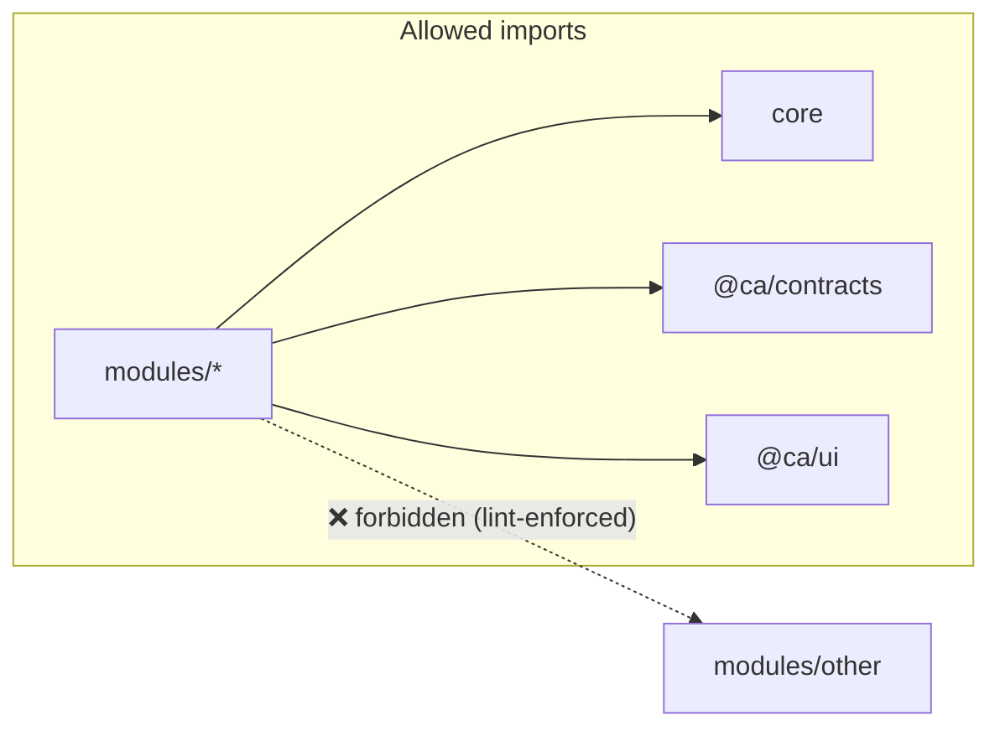

# Connect Affairs — Folder / Repository Structure

| | |
|---|---|
| **Document** | 03 — Repository Structure |
| **Status** | Draft for approval (Step 3 of 8) |
| **Layout** | pnpm monorepo · Turborepo task runner · TypeScript everywhere |

---

## 1. Principles the structure encodes

1. **Plugin modules are folders + a manifest.** A module lives in `apps/*/src/modules/<id>/`. A registry auto-discovers manifests at boot. Adding/removing a module never touches core.
2. **Shared code lives in `packages/`**, consumed by both apps: the contract (`contracts`), the component library (`ui`), and tooling (`config`).
3. **The contract is written once.** A Zod schema in `packages/contracts` produces the runtime validator *and* the TypeScript type used by API and web alike.
4. **Import boundaries are enforced by lint**, not goodwill: a module may import from `core`, `contracts`, and `ui` — never from another module. This makes independence structural.
5. **Clean-architecture layering per module**: `routes → controller → service → repository → prisma`.

---

## 2. Top-level layout

```
connect-affairs/
├─ apps/
│  ├─ api/                     # Node + Express modular monolith (backend)
│  └─ web/                     # React + Vite SPA (frontend)
├─ packages/
│  ├─ contracts/               # Zod schemas + inferred types + API contracts (shared FE/BE)
│  ├─ ui/                      # ShadCN-based component library + patterns
│  └─ config/                  # shared tsconfig / eslint / prettier / tailwind preset
├─ infra/
│  ├─ docker/                  # per-service Dockerfiles
│  ├─ nginx/                   # reverse proxy + TLS + static serving
│  ├─ compose/                 # docker-compose stacks (dev / prod / qnap-arm64)
│  └─ backup/                  # pg dump + off-site scripts
├─ .github/workflows/          # CI (lint/typecheck/test/build) + multi-arch release
├─ docs/                       # 01-ARCHITECTURE … this doc … module docs
├─ scripts/                    # dev bootstrap, codegen, module scaffolder
├─ pnpm-workspace.yaml
├─ turbo.json                  # cached lint/build/test pipelines (dev/CI only)
├─ package.json                # workspace root scripts
├─ tsconfig.base.json
├─ .env.example                # every variable, documented, no secrets
├─ .nvmrc                      # Node 20 LTS
├─ .gitignore
└─ README.md
```

*Turborepo runs only at dev/CI time (never on the NAS), so it costs the QNAP nothing.*

---

## 3. Backend — `apps/api`

```
apps/api/
├─ prisma/
│  ├─ schema/                        # Prisma multi-file schema (prismaSchemaFolder)
│  │  ├─ 00-core.prisma              # the core schema from Doc 02
│  │  ├─ 10-employee.prisma          # ← each module adds one file here (Phase 1)
│  │  └─ …                           #    named by module; one migration history
│  ├─ migrations/
│  └─ seed/
│     ├─ index.ts                    # orchestrator (idempotent)
│     ├─ 01-currencies.seed.ts
│     ├─ 02-company.seed.ts
│     ├─ 03-departments.seed.ts
│     ├─ 04-roles.seed.ts
│     ├─ 05-permissions.seed.ts      # generated from module manifests
│     └─ 06-super-admin.seed.ts      # from env vars, no hard-coded secret
├─ src/
│  ├─ core/                          # the platform "framework" — modules depend on it
│  │  ├─ server.ts                   # express app factory (helmet, cors, parsers)
│  │  ├─ app.ts                      # compose core + auto-register modules
│  │  ├─ registry/
│  │  │  ├─ module-registry.ts       # discovers *.module.ts, mounts routes/jobs/events
│  │  │  └─ module.types.ts          # ModuleManifest interface (Doc 01 §6)
│  │  ├─ middleware/
│  │  │  ├─ authenticate.ts          # JWT verification
│  │  │  ├─ authorize.ts             # RBAC permission check (module:action)
│  │  │  ├─ validate.ts              # Zod body/query/params
│  │  │  ├─ rate-limit.ts
│  │  │  ├─ csrf.ts
│  │  │  ├─ audit.ts
│  │  │  └─ error-handler.ts         # consistent error envelope
│  │  ├─ auth/                       # Phase 0.4 — jwt, refresh, 2FA, password policy, sessions
│  │  ├─ rbac/                       # permission resolver (roles + overrides)
│  │  ├─ audit/                      # audit writer (via Prisma extension + events)
│  │  ├─ approval/                   # generic approval engine (Doc 02 §5)
│  │  ├─ forwarding/                 # forward-for-comment/review/approval
│  │  ├─ notifications/              # dispatcher → in-app/email/sms/push + reminder engine
│  │  ├─ files/                      # StorageService (local ↔ S3), watermark, download log
│  │  ├─ search/                     # Postgres FTS query builder
│  │  ├─ export/                     # pdf-lib / xlsx / csv services
│  │  ├─ jobs/                       # pg-boss bootstrap + scheduler
│  │  ├─ events/                     # in-process event bus (typed)
│  │  ├─ db/
│  │  │  ├─ prisma.ts                # singleton client
│  │  │  └─ extensions.ts            # soft-delete filter + audit hooks
│  │  ├─ config/                     # env loading validated by Zod (fail-fast)
│  │  ├─ errors/                     # AppError hierarchy
│  │  ├─ http/                       # route factory, pagination/sort/filter helpers, responses
│  │  └─ logger/                     # pino + request id
│  ├─ modules/                       # ── business plugins ── (one folder each)
│  │  └─ employee/                   # example shape (delivered Phase 1)
│  │     ├─ employee.module.ts       # manifest: routes, permissions, jobs, events, nav, seed
│  │     ├─ employee.routes.ts       # thin: wires middleware + controller
│  │     ├─ employee.controller.ts   # HTTP in/out only
│  │     ├─ employee.service.ts      # business rules + transactions + events
│  │     ├─ employee.repository.ts   # the only Prisma access for this module
│  │     ├─ employee.reports.ts      # module report definitions
│  │     └─ __tests__/               # unit (service) + integration (routes)
│  ├─ types/                         # ambient/express augmentation (req.user, etc.)
│  └─ index.ts                       # entrypoint: config → db → jobs → http listen
├─ tests/                            # cross-module integration / e2e (supertest)
├─ Dockerfile → ../infra/docker/api.Dockerfile (referenced)
├─ package.json
├─ tsconfig.json                     # extends ../../tsconfig.base.json
└─ vitest.config.ts
```

**Layer rule (enforced):** `routes` may import `controller`; `controller` may import `service`; `service` may import `repository` + `events`; only `repository` imports Prisma. Nothing imports "upward."

---

## 4. Frontend — `apps/web`

```
apps/web/
├─ index.html
├─ public/                           # favicon, logo (dashboard watermark asset)
├─ src/
│  ├─ core/                          # the app shell + platform UI services
│  │  ├─ app/
│  │  │  ├─ App.tsx                  # providers: Redux, Router, Theme, Toast, ErrorBoundary
│  │  │  └─ providers.tsx
│  │  ├─ layout/
│  │  │  ├─ AppShell.tsx             # the ONE layout every page uses
│  │  │  ├─ Sidebar.tsx              # collapsible, role-filtered, favorites, quick access
│  │  │  ├─ Topbar.tsx               # global search, notifications, profile
│  │  │  ├─ Breadcrumbs.tsx
│  │  │  └─ Watermark.tsx            # subtle centered company logo on dashboard pages
│  │  ├─ registry/
│  │  │  ├─ module-registry.ts       # collects UI manifests → routes + nav
│  │  │  └─ module.types.ts          # UIModuleManifest
│  │  ├─ router/                     # route tree generated from manifests + permission gates
│  │  ├─ store/
│  │  │  ├─ store.ts                 # Redux Toolkit store
│  │  │  ├─ root-reducer.ts
│  │  │  └─ base-api.ts              # RTK Query base (auth header, refresh, tag types)
│  │  ├─ auth/                       # Phase 0.4 — auth slice, login/2FA/forgot pages, guards
│  │  ├─ rbac/                       # <Can>, usePermission, useRole
│  │  ├─ theme/                      # tokens, dark-mode provider (#11479B / #F5F8FC)
│  │  ├─ i18n/                       # language provider
│  │  ├─ hooks/                      # shared hooks (useDebounce, useTable, useExport…)
│  │  ├─ lib/                        # http utils, formatters (money/date via company tz)
│  │  └─ config/
│  ├─ modules/                       # ── business plugins (UI) ──
│  │  └─ employee/                   # example (Phase 1)
│  │     ├─ employee.module.tsx      # manifest: routes, nav entries, required permissions
│  │     ├─ pages/                   # ListPage, DetailPage, FormPage (built from ui patterns)
│  │     ├─ components/
│  │     ├─ api/employee.api.ts      # RTK Query endpoints injected into base-api
│  │     ├─ hooks/
│  │     └─ __tests__/
│  ├─ main.tsx
│  └─ vite-env.d.ts
├─ Dockerfile → ../infra/docker/web.Dockerfile (referenced)
├─ package.json
├─ tsconfig.json
├─ vite.config.ts
├─ tailwind.config.ts                # extends ../../packages/config tailwind preset
└─ vitest.config.ts
```

**Every page is assembled from `packages/ui` patterns** (§5), so header/sidebar/tables/forms are identical by construction — a page *cannot* drift from the design language.

---

## 5. Shared packages — `packages/*`

```
packages/
├─ contracts/                        # the shared source of truth (FE + BE)
│  └─ src/
│     ├─ common/                     # pagination, sort, filter, ApiEnvelope, id/date types
│     ├─ auth/                       # login / refresh / 2FA / session DTOs
│     ├─ core/                       # user, role, permission, notification, approval, forwarding…
│     ├─ employee/                   # (Phase 1) employee zod schemas + types
│     └─ index.ts                    # `import { LoginInput } from "@ca/contracts"`
│
├─ ui/                               # the ONE component library
│  └─ src/
│     ├─ primitives/                 # ShadCN: button, input, select, dialog, dropdown, table…
│     ├─ patterns/                   # composed, reusable everywhere:
│     │                              #   DataTable (sticky/resize/reorder/select/bulk/export/filter/paginate)
│     │                              #   FormShell (validate/draft/autosave/attach/comments/approval/version)
│     │                              #   ForwardBox · ApprovalTimeline · ActivityTimeline
│     │                              #   FilterBar · ExportMenu · PageScaffold · PageHeader
│     │                              #   EmptyState · LoadingSkeleton · ConfirmDialog · StatCard
│     ├─ charts/                     # Recharts wrappers (theme-aware)
│     ├─ hooks/  ·  lib/ (cn, utils)
│     └─ index.ts
│
└─ config/                           # tooling, shared by all workspaces
   ├─ tsconfig.base.json
   ├─ eslint-preset.cjs              # includes import-boundary rules (§7)
   ├─ prettier.config.cjs
   ├─ tailwind-preset.ts             # colors, radius, shadows, spacing tokens
   └─ package.json
```

---

## 6. Infrastructure & CI

```
infra/
├─ docker/
│  ├─ api.Dockerfile                 # multi-stage, node:20-alpine, arm64+amd64
│  ├─ web.Dockerfile                 # build SPA → serve via nginx
│  └─ .dockerignore
├─ nginx/
│  ├─ nginx.conf
│  └─ conf.d/connect-affairs.conf    # TLS, HSTS, gzip, SPA fallback, /api proxy, security headers
├─ compose/
│  ├─ docker-compose.yml             # base: postgres · api · web(nginx)
│  ├─ docker-compose.dev.yml         # hot reload, exposed ports
│  └─ docker-compose.qnac.yml        # arm64 images + per-container mem limits (TS-133)
└─ backup/
   ├─ pg-backup.sh                   # nightly encrypted dump → USB + off-site
   └─ restore.md                     # tested restore runbook

.github/workflows/
├─ ci.yml                            # install → lint → typecheck → test → build (turbo-cached)
└─ release.yml                       # buildx multi-arch images → registry, on tag
```

---

## 7. Conventions

| Topic | Rule |
|---|---|
| **File names** | `kebab-case.ts`; React components `PascalCase.tsx`; manifests `*.module.ts(x)`; tests `*.test.ts` in `__tests__/`. |
| **Path aliases** | `@ca/core`, `@ca/contracts`, `@ca/ui`, `@ca/config`; within a module use relative imports. |
| **Import boundaries** (ESLint) | `modules/*` → may import `core`, `@ca/contracts`, `@ca/ui`. ❌ never `modules/other`. `core` → never imports `modules`. Violations fail CI. |
| **Barrels** | Each package exposes a single `index.ts`; modules do **not** export to each other. |
| **Env** | All config via `.env`, validated by Zod at boot (fail-fast). `.env.example` documents every key. No secret in git. |
| **Errors** | Throw `AppError` subclasses; the error middleware maps them to the standard envelope. |
| **Commits** | Conventional Commits; module work scoped e.g. `feat(employee): …`. |

---

## 8. Adding a new module (the payoff)

To add, say, **Vehicle**, a developer creates four things and changes **zero** core files:

1. `apps/api/prisma/schema/90-vehicle.prisma` — the module's tables (reference core models).
2. `apps/api/src/modules/vehicle/vehicle.module.ts` — manifest (routes, permissions, jobs, events, nav, seed).
3. `apps/web/src/modules/vehicle/vehicle.module.tsx` — UI manifest (pages, nav, permissions).
4. `packages/contracts/src/vehicle/` — the Zod schemas/types shared by both.

On boot: the backend registry mounts `/api/vehicle`, registers its permissions, wires its jobs/events; the frontend registry adds its routes and role-filtered sidebar entries. `scripts/scaffold-module.ts` generates this skeleton in one command.



---

*Next: Doc 04 — Authentication (design + implementation), on your approval.*
