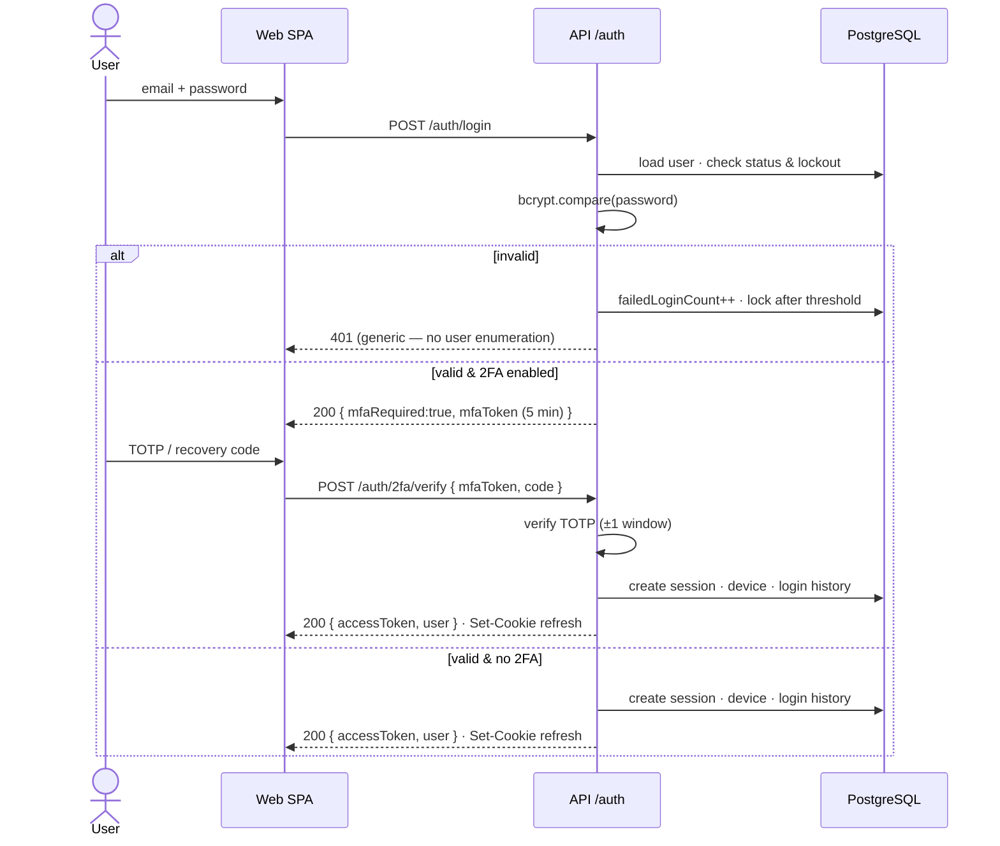
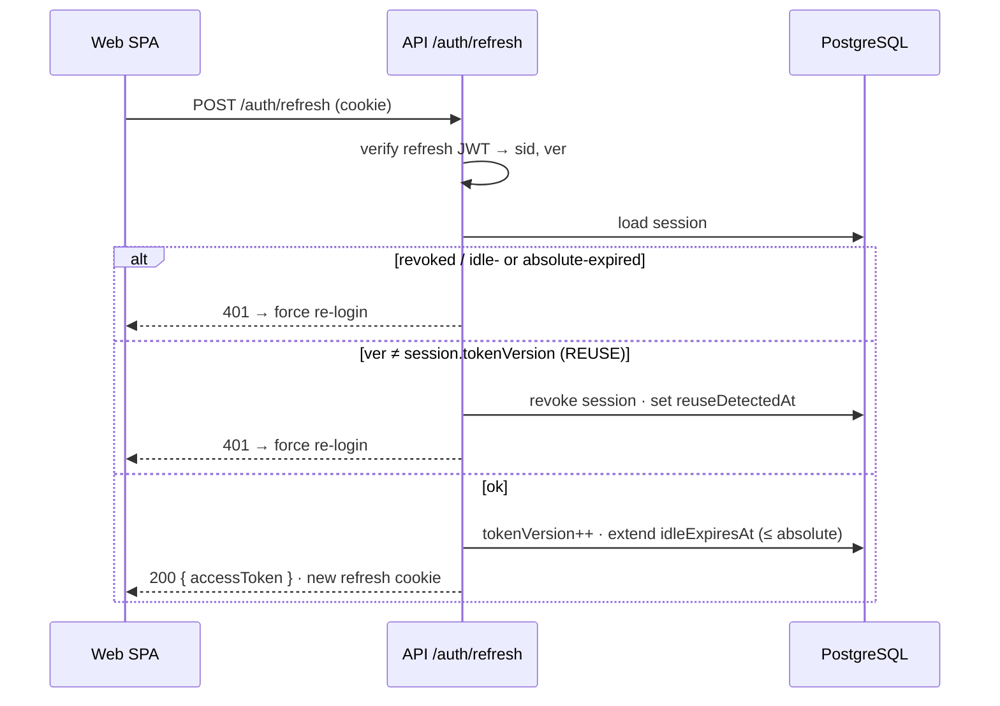

# Connect Affairs — Authentication & Access

| | |
|---|---|
| **Document** | 04 — Authentication |
| **Status** | Draft for approval (Step 4 of 8) |
| **Scope** | Login, JWT + rotating refresh, TOTP 2FA, password policy, sessions/devices, lockout, RBAC resolution |

---

## 1. Model at a glance

- **Two tokens.** A short-lived **access JWT** (15 min) sent in the `Authorization: Bearer` header; a long-lived **refresh JWT** delivered as an **httpOnly · Secure · SameSite=Strict cookie**. The access token is never stored in JS-readable storage; the refresh token is never readable by JS.
- **Refresh rotation with reuse detection.** Every refresh rotates the token and bumps a per-session version counter. Presenting an old (already-rotated) token is treated as theft → the whole session is revoked.
- **Stateless verification, stateful revocation.** Access tokens verify by signature (no DB hit). Sessions live in the `session` table, so any session/device can be revoked instantly.
- **Permissions resolved server-side, cached in-process.** The token carries roles; effective `module:action` permissions are computed from roles + per-user overrides and cached (invalidated on change).

---

## 2. Token design

| | Access token | Refresh token |
|---|---|---|
| Type | JWT (HS256) | JWT (HS256), **separate secret** |
| Transport | `Authorization: Bearer` header | httpOnly · Secure · SameSite=Strict cookie, path `/auth` |
| Lifetime | `ACCESS_TTL` = 15 min | idle `REFRESH_IDLE_TTL` (e.g. 8 h) · absolute `REFRESH_ABSOLUTE_TTL` (e.g. 7 d) |
| Payload | `{ sub, sid, roles[], typ:"access" }` | `{ sub, sid, ver, typ:"refresh" }` |
| Verified by | signature only (no DB) | signature **+** session lookup |
| Revocable | on expiry (≤15 min) or session revoke | immediately via session |

Access tokens deliberately **exclude** permissions (they change and can be large). They carry role keys; the API resolves effective permissions per request from an in-process cache (§6).

---

## 3. Session model (refines Doc 02 §5)

The `session` row is the unit of login and revocation:

```
session
  id                 (= sid in tokens)
  userId, deviceId?
  tokenVersion  Int  // current valid refresh version; rotation bumps it
  userAgent, ip
  issuedAt, lastUsedAt
  idleExpiresAt      // sliding; extended on each refresh
  absoluteExpiresAt  // hard cap; never extended
  revokedAt, revokedReason
  reuseDetectedAt
```

Rotation needs only an integer (`tokenVersion`) — no history rows — yet still detects reuse.

---

## 4. Core flows

### 4.1 Login (with optional 2FA)



On success `failedLoginCount` resets. If `mustChangePassword` is set, tokens are issued but the SPA routes to a forced change-password screen.

### 4.2 Refresh with reuse detection



The SPA calls `/auth/refresh` silently when an access token nears expiry (and once on load). A single Axios/RTK-Query interceptor queues in-flight requests during refresh.

---

## 5. Two-Factor Authentication (TOTP)

- **Enrol:** `POST /auth/2fa/setup` generates a secret (otplib), returns an `otpauth://` URI + QR. Secret is **AES-GCM encrypted** at rest; not active until confirmed.
- **Confirm:** `POST /auth/2fa/enable { code }` verifies a live code, flips `twoFactorEnabled`, and issues **10 single-use recovery codes** (shown once, stored hashed).
- **Login:** as in §4.1 — a TOTP code *or* a recovery code satisfies the challenge.
- **Disable:** `POST /auth/2fa/disable` requires password **and** a current code.
- Super Admin can require 2FA org-wide via a company policy setting.

---

## 6. RBAC resolution (roles + overrides + break-glass)

Effective permissions = (union of role permissions) then apply per-user overrides (`ALLOW` adds, `DENY` removes). `isSuperAdmin` bypasses the matrix. Cached in-process per user, invalidated on any role/permission/override change.

```ts
// core/rbac/resolve-permissions.ts
export async function resolveEffectivePermissions(userId: string): Promise<Set<string>> {
  const hit = permCache.get(userId);
  if (hit) return hit;

  const user = await prisma.user.findUniqueOrThrow({
    where: { id: userId },
    include: {
      roles:     { include: { role: { include: { permissions: { include: { permission: true } } } } } },
      overrides: { include: { permission: true } },
    },
  });

  if (user.isSuperAdmin) return ALL_PERMISSIONS;            // break-glass

  const set = new Set<string>();
  for (const ur of user.roles)
    for (const rp of ur.role.permissions) set.add(rp.permission.key);
  for (const ov of user.overrides)
    ov.effect === "ALLOW" ? set.add(ov.permission.key) : set.delete(ov.permission.key);

  permCache.set(userId, set);                               // TTL + explicit bust on change
  return set;
}
```

```ts
// core/middleware/authorize.ts — applied by the route factory to every protected endpoint
export const authorize = (required: string) => async (req, _res, next) => {
  const perms = await resolveEffectivePermissions(req.user.id);
  if (!perms.has(required)) return next(new ForbiddenError(required));
  next();
};
```

The web mirror: `/auth/me` returns the effective permission keys; `<Can permission="employee:create">…</Can>` and `usePermission()` gate UI. **UI gating is convenience; the API is the enforcement boundary.**

---

## 7. Password policy

| Control | Default (configurable in Settings) |
|---|---|
| Hashing | **bcrypt**, cost tuned to ~250 ms on target hardware (start cost 11 on the ARM TS-133) |
| Minimum length | 12, plus upper/lower/digit/symbol |
| History | last **5** hashes blocked (`password_history`) |
| Expiry | optional (e.g. 90 days) → sets `mustChangePassword` |
| Reset side-effects | changing/resetting a password **revokes all sessions** |
| Breach check | optional HaveIBeenPwned k-anonymity — **off by default** (no external dependency) |

### Forgot / reset

`POST /auth/forgot-password` always returns 200 (no enumeration); if the account exists, a hashed, 30-minute `password_reset_token` is created and emailed. `POST /auth/reset-password { token, newPassword }` verifies the token, enforces policy + history, updates the hash, revokes all sessions, and audits the event.

---

## 8. Sessions, devices & timeout

- **Idle timeout** = sliding `idleExpiresAt`, extended on refresh; **absolute timeout** = hard `absoluteExpiresAt`, never extended. Both configurable per company policy.
- **Front-end idle detection** warns before auto-logout on inactivity.
- **Active sessions:** `GET /auth/sessions` lists device, IP, last-used, and marks the current one; `DELETE /auth/sessions/:id` and `POST /auth/sessions/revoke-others` revoke.
- **Devices:** first login from a fingerprint registers a `device`; users can name, trust, or remove devices. Login from a new device can trigger a notification.
- **Login history:** every attempt (success/failure + reason + IP/UA) is recorded and viewable by the user and admins.

---

## 9. Endpoint surface (`/api/auth`)

| Method | Path | Purpose |
|---|---|---|
| POST | `/login` | password auth → tokens or `mfaRequired` |
| POST | `/2fa/verify` | complete MFA challenge → tokens |
| POST | `/refresh` | rotate tokens (reuse-detecting) |
| POST | `/logout` | revoke current session, clear cookie |
| GET | `/me` | current user + effective permissions |
| POST | `/change-password` | authenticated change |
| POST | `/forgot-password` · `/reset-password` | recovery |
| POST | `/2fa/setup` · `/2fa/enable` · `/2fa/disable` | manage TOTP |
| POST | `/2fa/recovery-codes` | regenerate recovery codes |
| GET | `/sessions` · DELETE `/sessions/:id` · POST `/sessions/revoke-others` | session mgmt |
| GET | `/devices` · PATCH `/devices/:id` · DELETE `/devices/:id` | device mgmt |
| GET | `/login-history` | recent attempts |

Every endpoint validates input with Zod, is rate-limited, and (where it mutates) writes an audit record.

---

## 10. How auth satisfies the security requirements

| Requirement | Mechanism |
|---|---|
| Encrypted passwords | bcrypt (cost-tuned), never reversible; history-checked |
| RBAC | roles + per-user overrides + break-glass, enforced in middleware **and** UI |
| CSRF protection | access token in header (not CSRF-able); refresh cookie is `SameSite=Strict` + custom-header check on `/auth/refresh` |
| Rate limiting | per-IP+account limits on login/refresh/forgot/2FA (express-rate-limit) |
| Brute-force | lockout after N failures for a cooldown window |
| SQL injection | parameterized Prisma queries only — no string-built SQL |
| XSS | React auto-escaping + sanitised rich text + strict CSP (helmet) |
| HTTPS | TLS at Nginx/Cloudflare; HSTS; Secure cookies |
| Audit | every privileged auth action logged immutably |
| Token theft | refresh rotation + reuse detection revokes the session family |

---

## 11. Configuration (env, validated at boot)

```
JWT_ACCESS_SECRET=            # distinct strong secret
JWT_REFRESH_SECRET=           # distinct strong secret
ACCESS_TTL=15m
REFRESH_IDLE_TTL=8h
REFRESH_ABSOLUTE_TTL=7d
BCRYPT_COST=11                # tuned to ~250ms on the target CPU
LOCKOUT_THRESHOLD=5
LOCKOUT_DURATION=15m
PASSWORD_MIN_LENGTH=12
PASSWORD_HISTORY=5
ENCRYPTION_KEY=               # AES-GCM key for 2FA secrets & sensitive fields
MFA_ISSUER=Connect Affairs
```

All are Zod-validated on startup; a missing/weak secret **fails fast** rather than starting insecure.

---

*Next: Step 5 — the reusable UI component library (first actual code), on your approval. This is where the design language becomes real: AppShell, DataTable, FormShell, ForwardBox, and the rest.*
